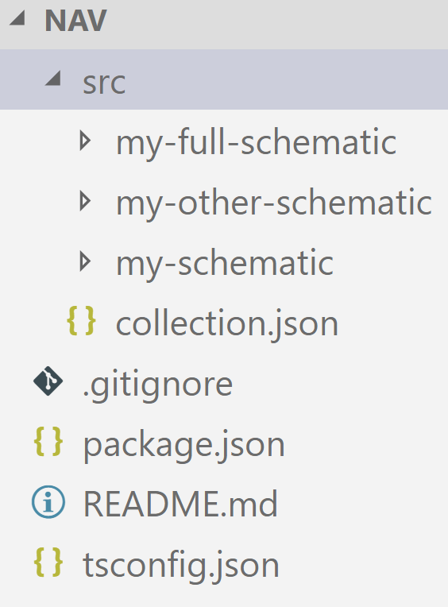
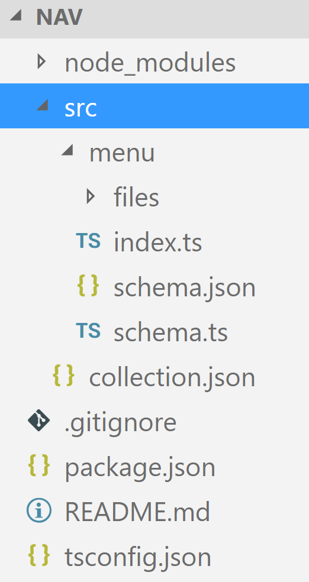

# Generating Custom Code with the Angular CLI and Schematics

Since some versions, the Angular CLI uses a library called [Schematics](https://www.npmjs.com/package/@angular-devkit/schematics) to scaffold building blocks like components or services. One of the best things about this is that Schematics allows to create own code generators too. Using this extension mechanism, we can [modify the way the CLI generates code](https://blog.angularindepth.com/creating-your-own-application-template-for-angular-cli-95e22319cc24). But we can also provide custom collections with code generators and publish them as npm packages. A good example for this is [Nrwl's Nx](https://nrwl.io/nx) which allows to generated boilerplate code for [Ngrx](https://github.com/ngrx) or upgrading an existing application from AngularJS 1.x to Angular.

These code generators are called Schematics and can not only create new files but also modify existing ones. For instance, the CLI uses the latter to register generated components with existing modules.

In this chapter, I'm showing how to create a collection with a custom Schematic from scratch and how to use it with an Angular project. The [sources](https://github.com/manfredsteyer/schematics-intro) can be found [here](https://github.com/manfredsteyer/schematics-intro).

In addition to this, you'll find a nice [video with Mike Brocchi from the CLI-Team explaining the basics and ideas behind Schematics here](https://www.youtube.com/watch?v=ZKyz0lb0GjA).

## Goal

To demonstrate how to write a simple Schematic from scratch, I will build a code generator for a Bootstrap based side menu. With an respective template like the free ones at [Creative Tim](https://www.creative-tim.com/) the result could look like this:


Before creating a generator it is a good idea to have an existing solution that contains the code you want to generate in all variations. 

In our case, the component is quite simple:

```TypeScript
import { Component, OnInit } from '@angular/core';

@Component({
    selector: 'menu',
    templateUrl: 'menu.component.html'
})
export class MenuComponent {
}
```

In addition to that, the template for this component is just a bunch of html tags with the right Bootstrap based classes -- something I cannot learn by heart what's the reason a generator seems to be a good idea:

```HTML
<div class="sidebar-wrapper">
    <div class="logo">
        <a class="simple-text">
            AppTitle
        </a>
    </div>
    <ul class="nav">

        <li>
            <a>
                <i class="ti-home"></i>
                <p>Home</p>
            </a>
        </li>

        <!-- add here some other items as shown before -->
    </ul>
</div>
```

In addition to the code shown before, I want also have the possibility to create a more dynamic version of this side menu. This version uses an interface ``MenuItem`` to represent the items to display:

```TypeScript
export interface MenuItem {
    title: string;
    iconClass: string;
}
```

A ``MenuService`` is providing instances of ``MenuItem``:

```TypeScript
import { MenuItem } from './menu-item';

export class MenuService {

    public items: MenuItem[] = [
        { title: 'Home', iconClass: 'ti-home' },
        { title: 'Other Menu Item', iconClass: 'ti-arrow-top-right' },
        { title: 'Further Menu Item', iconClass: 'ti-shopping-cart'},
        { title: 'Yet another one', iconClass: 'ti-close'}
    ];

}
```

The component gets an instance of the service by the means of dependency injection:

```TypeScript
import { Component, OnInit } from '@angular/core';
import { menuItem } from './menu-item';
import { menuService } from './menu.service';

@Component({
    selector: 'menu',
    templateUrl: './menu.component.html',
    providers:[MenuService]
})
export class MenuComponent {

    items: MenuItem[];

    constructor(service: MenuService) {
        this.items = service.items;
    }
}
```

After fetching the ``MenuItems`` from the service the component iterates over them using ``*ngFor`` and creates the needed markup:

```HTML
<div class="sidebar-wrapper">
    <div class="logo">
        <a class="simple-text">
            AppTitle
        </a>
    </div>
    <ul class="nav">
        <li *ngFor="let item of items">
            <a href="#">
                <i class="{{item.iconClass}}"></i>
                <p>{{item.title}}</p>
            </a>
        </li>
    </ul>
</div>
```

Even though this example is quite easy it provides enough stuff to demonstrate the basics of Schematics.

## Scaffolding a Collection for Schematics ... with Schematics

To provide a project structure for an npm package with a Schematics Collection, we can leverage Schematics itself. The reason is that the product team provides a "meta schematic" for this. To get everything up and running we need to install the following npm packages:

- ``@angular-devkit/schematics`` for executing Schematics
- ``@schematics/schematics`` for scaffolding a Collection
- ```rxjs`` which is a needed transitive dependency 

For the sake of simplicity, I've installed them globally:

```
npm i -g @angular-devkit/schematics
npm i -g @schematics/schematics
npm i -g rxjs
```

In order to get our collection scaffolded we just need to type in the following command:

```
schematics @schematics/schematics:schematic --name nav
```

The parameter ``@schematics/schematics:schematic`` consists of two parts. The first part -- ``@schematics/schematics`` -- is the name of the collection, or to be more precise, the npm package with the collection. The second part -- ``schematic`` -- is the name of the Schematic we want to use for generating code. 

After executing this command we get an npm package with a collection that holds three demo schematics:

{width=25%}


The file ``collection.json`` contains metadata about the collection and points to the schematics in the three sub folders. Each schematic has meta data of its own describing the command line arguments it supports as well as generator code. Usually, they also contain template files with placeholders used for generating code. But more about this in the following sections.

Before we can start, we need to ``npm install`` the dependencies the generated ``package.json`` points to. In addition to that, it is a good idea to rename its section ``dependencies`` to ``devDependencies`` because we don't want to install them when we load the npm package into a project:

```JSON
{
  "name": "nav",
  "version": "0.0.0",
  "description": "A schematics",
  "scripts": {
    "build": "tsc -p tsconfig.json",
    "test": "npm run build && jasmine **/*_spec.js"
  },
  "keywords": [
    "schematics"
  ],
  "author": "",
  "license": "MIT",
  "schematics": "./src/collection.json",
  "devDependencies": {
    "@angular-devkit/core": "^0.0.15",
    "@angular-devkit/schematics": "^0.0.25",
    "@types/jasmine": "^2.6.0",
    "@types/node": "^8.0.31",
    "jasmine": "^2.8.0",
    "typescript": "^2.5.2"
  }
}
``` 

As you saw in the last listing, the ``packages.json`` contains a field ``schematics`` which is pointing to the file ``collection.json`` to inform about the metadata. 

## Adding an custom Schematic

The three generated schematics contain comments that describe quite well how Schematics works. It is a good idea to have a look at them. For this tutorial, I've deleted them to concentrate on my own schematic. For this, I'm using the following structure:

{width=25%}


The new folder ``menu`` contains the custom schematic. It's command line arguments are described by the file ``schema.json`` using a json schema. The described data structure can also be found as an interface within the file ``schema.ts``. Normally it would be a good idea to generate this interface out of the schema but for this easy case I've just handwritten it. 

The ``index.ts`` contains the so called factory for the schematic. This is a function that generates a rule (containing other rules) which describes how the code can be scaffolded. The templates used for this are located in the ``files`` folder. We will have a look at them later.

First of all, let's update the ``collection.json`` to make it point to our menu schematic:

```JSON
{
    "schematics": {
      "menu": {
        "aliases": [ "mnu" ],
        "factory": "./menu",
        "description": "Generates a menu component",
        "schema": "./menu/schema.json"
      }
    }
}
```

Here we have an property ``menu`` for the menu schematic. This is also the name we reference when calling it. The array ``aliases`` contains other possible names to use and ``factory`` points to the file with the schematic's factory. Here, it points to ``./menu`` which is just a folder. That's why the factory is looked up in the file ``./menu/index.js``. 

In addition to that, the ``collection.json`` also points to the schema with the command line arguments. This file describes a property for each possible argument:

```JSON
{
    "$schema": "http://json-schema.org/schema",
    "id": "SchemanticsForMenu",
    "title": "Menu Schema",
    "type": "object",
    "properties": {
      "name": {
        "type": "string",
        "default": "name"
      },
      "path": {
        "type": "string",
        "default": "app"
      },
      "appRoot": {
        "type": "string"
      },
      "sourceDir": {
        "type": "string",
        "default": "src"
      },
      "menuService": {
        "type": "boolean",
        "default": false,
        "description": "Flag to indicate whether an menu service should be generated.",
        "alias": "ms"
      }
    }
  }
```

The argument ``name`` holds the name of the menu component, its ``path`` as well as the path of the app (``appRoot``) and the ``src`` folder (``sourceDir``). These parameters are usually used by all schematics the CLI provides. In addition to that, I've defined a property ``menuService`` to indicate, whether the above mentioned ``service`` class should be generated too.

The interface for the schema within ``schema.ts`` is called ``MenuOptions``:

```TypeScript
export interface MenuOptions {
    name: string;
    appRoot: string;
    path: string;
    sourceDir: string;
    menuService: boolean;
}
```

## Schematic Factory

To tell Schematics how to generated the requested code files, we need to provide a factory. This function describes the necessary steps with a rule which normally makes use of further rules:

```TypeScript
import { MenuOptions } from './schema';
import { Rule, [...] } from '@angular-devkit/schematics';
[...]
export default function (options: MenuOptions): Rule {
    [...]
}
```   

For this factory, I've defined two helper constructs at the top of the file:

```TypeScript
import { dasherize, classify } from '@angular-devkit/core';
import { MenuOptions } from './schema';
import { filter, Rule, [...] } from '@angular-devkit/schematics';

[...]

const stringUtils = { dasherize, classify };

function filterTemplates(options: MenuOptions): Rule {
  if (!options.menuService) {
    return filter(path => !path.match(/\.service\.ts$/) && !path.match(/-item\.ts$/) && !path.match(/\.bak$/));
  }
  return filter(path => !path.match(/\.bak$/));
}

[...]
```

The first one is the object ``stringUtils`` which just groups some functions we will need later within the templates: The function ``dasherize`` transforms a name into its kebab case equivalent which can be used as a file name (e. g. ``SideMenu`` to ``side-menu``) and ``classify`` transforms into Pascal case for class names (e. g. ``side-menu`` to ``SideMenu``).

The function ``filterTemplates`` creates a Rule that filters the templates within the folder ``files``. For this, it delegates to the existing ``filter`` rule. Depending on whether the user requested a menu service, more or less template files are used. To make testing and debugging easier, I'm excluding ``.bak`` in each case.

Now let's have a look at the factory function:

```TypeScript
import { chain, mergeWith } from '@angular-devkit/schematics';
import { dasherize, classify } from '@angular-devkit/core';
import { MenuOptions } from './schema';
import { apply, filter, move, Rule, template, url, branchAndMerge } from '@angular-devkit/schematics';
import { normalize } from '@angular-devkit/core';

[...]

export default function (options: MenuOptions): Rule {

    options.path = options.path ? normalize(options.path) : options.path;
    
    const templateSource = apply(url('./files'), [
        filterTemplates(options),
        template({
          ...stringUtils,
          ...options
        }),
        move(options.sourceDir)
      ]);
      
      return chain([
          mergeWith(templateSource)
      ]);

}
```

At the beginning, the factory normalizes the path the caller passed in. This means that it deals with the conventions of different operating systems, e. g. using different path separators (e. g. ``/`` vs. ``\``).

Then, it uses ``apply`` to apply all templates within the ``files`` folder to the passed rules. After filtering the available templates they are executed with the rule returned by ``template``. The passed properties are used within the templates. This creates a virtual folder structure with generated files that is moved to the ``sourceDir``. 

The resulting ``templateSource`` is a ``Source`` instance. It's responsibility is creating a ``Tree`` object that represents a file tree which can be either virtual or physical. Schematics uses virtual file trees as a staging area. Only when everything worked, it is merged with the physical file tree on your disk. You can also think about this as committing a transaction.

At the end, the factory returns a rule created with the ``chain`` function (which is a rule too). It creates a new rule by chaining the passed ones. In this example we are just using the rule ``mergeWith`` but the enclosing ``chain`` makes it extendable.

As the name implies, ``mergeWith`` merges the ``Tree`` represented by ``templateSource`` with the tree which represents the current Angular project.

## Templates

Now it's time to look at our templates within the ``files`` folder:

{width=25%}


The nice thing about this is that the file names are templates too. For instance ``__x__`` would be replaced with the contents of the variable ``x`` which is passed to the ``template`` rule. You can even call functions to transform these variables. In our case, we are using ``__name@dasherize__`` which passes the variable name to the function ``dasherize`` which in turn is passed to ``template`` too.

The easiest one is the template for the item class which represents a menu item:

```TypeScript
export interface <%= classify(name) %>Item {
    title: string;
    iconClass: string;
}
```

Like in other known template languages (e. g. PHP), we can execute code for the generation within the delimiters ``<%`` and ``%>``. Here, we are using the short form ``<%=value%>`` to write a value to the generated file. This value is just the name the caller passed transformed with ``classify`` to be used as a class name.

The template for the menu service is build in a similar way:

```TypeScript
import { <%= classify(name) %>Item } from './<%=dasherize(name)%>-item';

export class <%= classify(name) %>Service {

    public items: <%= classify(name) %>Item[] = [
        { title: 'Home', iconClass: 'ti-home' },
        { title: 'Other Menu Item', iconClass: 'ti-arrow-top-right' },
        { title: 'Further Menu Item', iconClass: 'ti-shopping-cart'},
        { title: 'Yet another one', iconClass: 'ti-close'}
    ];
}
```

In addition to that, the component template contains some ``if`` statements that check whether a menu service should be used:

```TypeScript
import { Component, OnInit } from '@angular/core';
<% if (menuService) { %>
import { <%= classify(name) %>Item } from './<%=dasherize(name)%>-item';
import { <%= classify(name) %>Service } from './<%=dasherize(name)%>.service';
<% } %>

@Component({
    selector: '<%=dasherize(name)%>',
    templateUrl: '<%=dasherize(name)%>.component.html',
    <% if (menuService) { %>
        providers: [<%= classify(name) %>Service]
    <% } %>
})
export class <%= classify(name) %>Component {

<% if (menuService) { %>
    items: <%= classify(name) %>Item[];

    constructor(service: <%= classify(name) %>Service) {
        this.items = service.items;
    }
<% } %>

}
```

The same is the case for the component's template. When the caller requested a menu service, it's using it; otherwise it just gets hardcoded sample items:

```HTML
<div class="sidebar-wrapper">
    <div class="logo">
        <a class="simple-text">
            AppTitle
        </a>
    </div>
    <ul class="nav">

<% if (menuService) { %>
    <li *ngFor="let item of items">
        <a>
            <i class="{{item.iconClass}}"></i>
            <p>{{item.title}}</p>
        </a>
    </li>

<% } else { %>
        <li>
            <a>
                <i class="ti-home"></i>
                <p>Home</p>
            </a>
        </li>

        <li>
            <a>
                <i class="ti-arrow-top-right"></i>
                <p>Other Menu Item</p>
            </a>
        </li>

		<li>
			<a>
				<i class="ti-shopping-cart"></i>
				<p>Further Menu Item</p>
			</a>
		</li>

		<li>
			<a>
				<i class="ti-close"></i>
				<p>Yet another one</p>
			</a>
		</li>
        <% } %>
    </ul>
</div>
```

## Building and Testing with a Sample Application

To build the npm package, we just need to call ``npm run build`` which is just triggering the TypeScript compiler.

For testing it, we need a sample application that can be created with the CLI. Please make sure to use Angular CLI version 1.5 RC.4 or higher.

For me, the easiest way to test the collection was to copy the whole package into the sample application's ``node_module`` folder so that everything ended up within ``node_modules/nav``. Please make sure to exclude the collection's ``node_modules`` folder, so that there is no folder ``node_modules/nav/node_modules``. 

Instead of this, pointing to a relative folder with the collection should work too. In my experiments, I did with a release candidate, this wasn't the case (at least not in any case).

After this, we can use the CLI to scaffold our side menu:

```
ng g menu side-menu --menuService --collection nav
```

Here, ``menu`` is the name of the schematic, ``side-menu`` the file name we are passing and ``nav`` the name of the npm package.


After this, we need to register the generated component with the ``AppModule``:

```TypeScript
import { SideMenuComponent } from './side-menu/side-menu.component';
import { BrowserModule } from '@angular/platform-browser';
import { NgModule } from '@angular/core';

import { AppComponent } from './app.component';

@NgModule({
  declarations: [
    AppComponent,
    SideMenuComponent
  ],
  imports: [
    BrowserModule
  ],
  providers: [],
  bootstrap: [AppComponent]
})
export class AppModule { }
```

In the next chapters, I will show how to even automate this task with Schematics.

After this, we can call the component in our ``AppModule``. The following sample also contains some boiler blade for the Bootstrap Theme used in the initial screen shot.

```
<div class="wrapper">
  <div class="sidebar" data-background-color="white" data-active-color="danger">

      <side-menu></side-menu>
  
  </div>
  <div class="main-panel">
      <div class="content">
        <div class="card">
          <div class="header">
            <h1 class="title">Hello World</h1>
          </div>
          <div class="content">
            <div style="padding:7px">
             Lorem ipsum ...
            </div>
          </div>
        </div>
      </div>
  </div>
</div>
```

To get Bootstrap and the Bootstrap Theme, you can download the free version of the [paper theme](https://www.creative-tim.com/) and copy it to your ``assets`` folder. Also reference the necessary files within the file ``.angular-cli.json`` to make sure they are copied to the output folder:

```
[...]
"styles": [
  "styles.css",
  "assets/css/bootstrap.min.css",
  "assets/css/paper-dashboard.css",
  "assets/css/demo.css",
  "assets/css/themify-icons.css"
],
[...]
```

After this, we can finally run our application: ``ng serve``.


